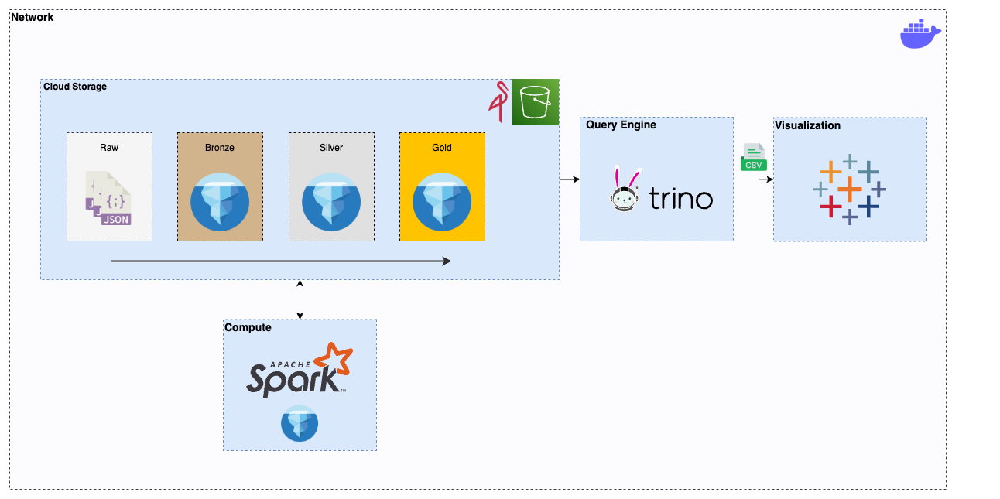
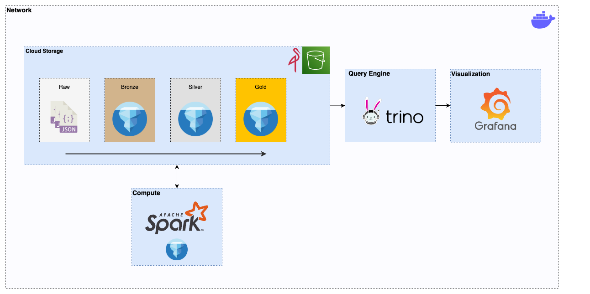
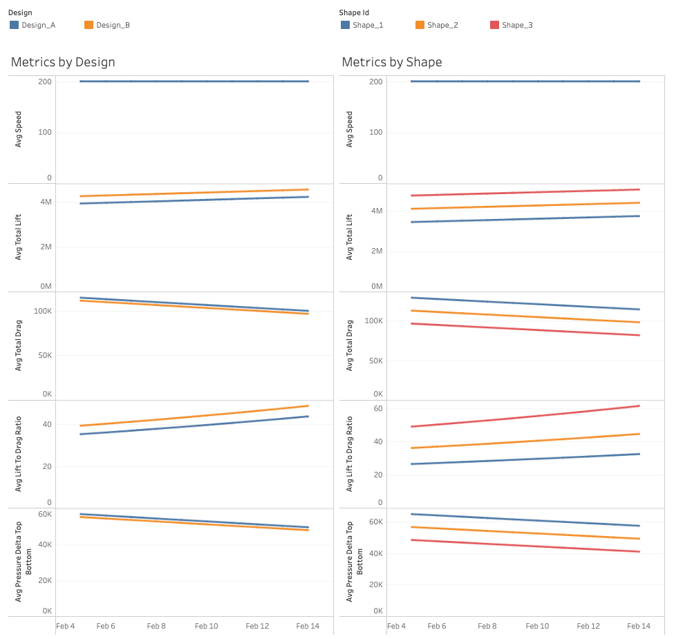

## Description

This project processes Computational Fluid Dynamics (CFD) simulations for aircraft.

The aim is to create a production-grade data pipeline along with visualizations that can be run locally using only free and open-source projects, simulating real-life infrastructure where the different components are separated.

The project is fully containerized, and the code is designed to be portable to a real environment.

## Architecture

Incoming data is parsed and processed in batch by Apache Spark into our cloud storage (Minio), where it is stored in Apache Iceberg format. From here, it is queryable by Trino, which serves the visualizations.

* **Data Processing:** Spark with Iceberg plugin
* **Cloud Storage:** Minio
* **Query Engine:** Trino
* **Visualization:** Tableau / Grafana

**Disclaimer**: At the moment, Tableau is used for visualization because the Iceberg REST catalog cannot support concurrent queries from Trino (causes the service to crash). The target state is to use Grafana with its Trino plugin and dashboards provisioned as code for visualization.

**Current State**



**Target State**



#### Pipeline

The pipelines that transform the data use an Apache Spark (PySpark) container for compute. General pipeline logic is abstracted into a class and specific transform functions have unit tests (Pytest).

#### Storage

The data lake is built using Minio and simulates an S3 bucket. Data is stored in Apache Iceberg format and follows the Medallion multi-hop architecture.

Iceberg allows us to enforce ACID transactions, use Time Travel, use Schema Evolution, and access Optimizations based on Metadata (e.g., data skipping).

## Visualization & Analysis

#### Dashboard

A sample Tableau dashboard demonstrates the analysis capabilities of this project. The dashboard is not included in this repository.

<a href="https://public.tableau.com/app/profile/c.braley/viz/CFD_Aircraft_Analysis/Dashboard1">Link to Dashboard</a>



#### Analysis

Our analysis is focused on how the shape and design of aircraft affect the amount of lift, drag and upward pressure they are able to create, given a constant speed.

##### Key metrics:

**lift**: The upward force generated by the aircraft. Generating a greater amount of lift allows the aircraft to carry more weight, take off in shorter distances, and maintain flight at lower speeds.

**drag**: The force that opposes the aircraft's motion. Lowering drag means better fuel efficiency, higher speeds, and improved range.

**pressure delta top bottom**: The difference in pressure acting on the top and bottom surfaces.This pressure difference generates lift. A higher positive pressure delta signifies greater lift generation.

**lift-to-drag ratio**: The ratio of generated lift to drag. Quantifies the aircraft's aerodynamic efficiency. A higher lift-to-drag ratio indicates improved fuel efficiency and overall performance.

#### Insights

1. **The optimum aircraft is Design B, Shape 3**: This version is able to produce the highest amount of lift with the smallest amount of drag.
2. **Improved metrics over time:** As time progresses all metrics are improving, indicating that optimizations are being made either to the aircraft itself or to the conditions in which the simulations are occurring

## Setup

#### Prerequisites

* **Docker and Docker Compose:** Must be installed and configured locally.
* **Python 3.x:** Must be installed and configured locally.
* **Make:** Must be installed.
* **Spark:** Must be installed and configured locally to run tests.

#### Initial Setup

1.  **Clone the repository:**

    ```bash
    git clone [https://github.com/cjbraley/cfd_project.git](https://github.com/cjbraley/cfd_project.git)
    cd cfd_project
    ```

2.  **Initialize the project:**

    Run the following command to create a virtual environment and install the necessary Python dependencies:

    ```bash
    make init
    ```

    **Note:** This command only needs to be run once.

## Running the Project

1.  **Start the Docker containers:**

    Run the following command to start the Docker Compose services:

    ```bash
    make up
    ```

2.  **Run the ETL pipeline:**

    Execute the bronze, silver, and gold pipelines in sequence:

    ```bash
    make etl
    ```

3.  **Run the extract pipeline:**

    Execute the extract pipeline:

    ```bash
    make extract
    ```

## Additional Commands

* **Stop the Docker containers:**

    ```bash
    make down
    ```

* **Run unit tests:**

    ```bash
    make test
    ```

    **Note:** Ensure Spark is installed and configured locally before running tests.

## Improvements / To Do

1. Fix Iceberg Catalog concurrent query issues to allow use of Grafana for frontend
2. Add orchestration tool to manage jobs instead of running manually
3. Add ongoing data quality checks using Great Expectations
4. Add CI / CD process that runs unit tests on commit / push
5. Move credentials to `.env` file and eventually to a secret manager
6. Add additional visualizations. Espeically for more granular analysis on specific shape + design combinations.